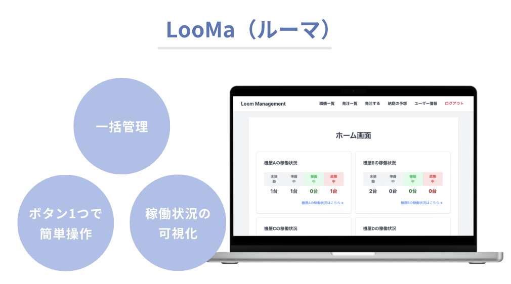
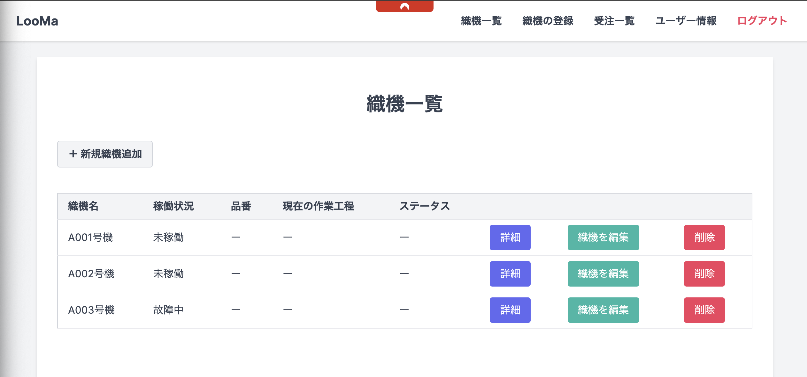
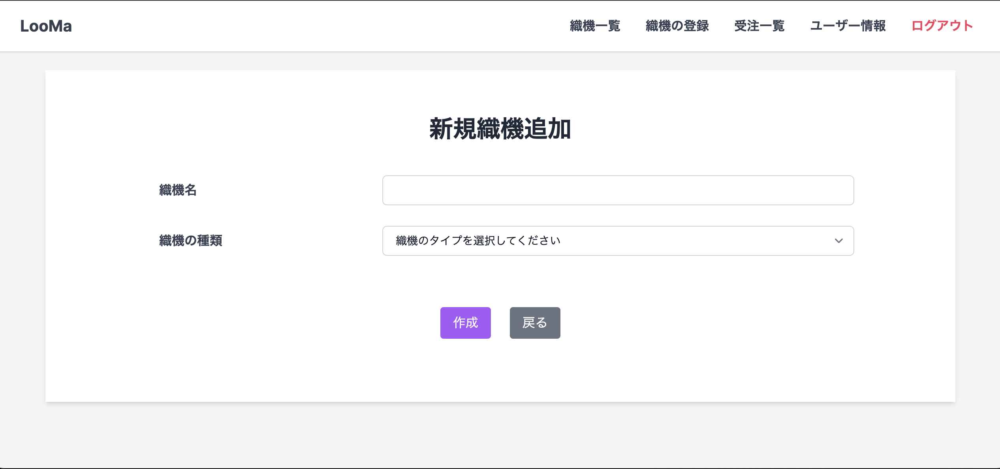

# LooMa

山梨県富士吉田市の業務効率化支援事業の一環として、高級先染織物を製造販売する企業の課題解決を目指し、業務効率化を目的としたアプリケーション【LooMa（ルーマ）】を開発しました。
LooMa（ルーマ）は、織物工場における「受注・製造管理」の効率化を目的としたアプリケーションです。
織機（ドビー、ジャガードなど）の稼働状況、作業工程、納期見込みなどを一元管理し、管理者や各依頼先が製造進捗を正確かつスムーズに把握できるように設計されています。

## URL
<https://quiet-castle-08484-07016287084f.herokuapp.com/login>
### ログイン情報
- **管理者**:  
メールアドレス: <aaa@example.com>  
パスワード: password  
- **依頼先**:  
メールアドレス: <bbb@example.com>  
（メールアドレスの上3文字は、bbb ~ iiiまでログイン可能です。）  
パスワード: password

## 開発背景
- **現場の見える化**:  
  工場内の複数の織機や受注が同時進行する中、進捗状況の把握・共有に手間がかかる問題を解決するため。
- **納期の正確な把握**:  
  作業工程ごとの推定作業期間（ナレッジ）をベースにした「最短・最長」の納期見込みを管理し、遅延リスクを事前に検知できるようにするため。
- **織機の割り当て最適化**:  
  織機の故障や稼働状況を可視化し、重複割り当てなどによる作業停滞を防止するため。
- **権限管理**:  
  管理者と一般ユーザーで必要な機能・画面が異なるため、ロール別に機能を分けて操作性と安全性を高めるため。

## 主な使用技術
- **フレームワーク**: Ruby on Rails（7.2.2）
- **言語**: Ruby（3.3.6）
- **データベース**: PostgreSQL
- **フロントエンド**: Tailwind CSS, Stimulus, Turbo
- **インフラ（PaaS）**: Heroku
- **その他ライブラリ / Gem**:
  - 認証関連: bcrypt
  - テスト関連: RSpec, Capybara, Factory Bot など
  - コード解析・静的チェック: RuboCop, Brakeman
  - ガントチャート表示: frappe-gantt
  - 他、Rails標準機能や各種プラグイン（web-console, turbo-rails など）

## 機能紹介
### 【管理者画面】
| ホーム画面 | 織機画面 |
| ------------- | ------------- |
|  |  |
| 各依頼先が保有している織機の稼働状況を一括で確認できます。織機の割り当てができていない発注にはフラッシュメッセージが表示されます。 | 各機屋が保有しているすべての織機が確認できます。会社名、織機名、発注した品番から絞り込みもできます。 |

| 発注画面 | ユーザー情報画面 |
| ------------- | ------------- |
|  |  |
| 現在発注している内容が一覧で確認できます。また、発注の詳細や織機の割り当ても対応可能です。 | ユーザー情報を管理する画面になります。（クライアント側のITリテラシーを考慮して、管理画面からのみユーザー新規登録が可能、一度だけログインに必要なメールアドレスとパスワードが表示されます。） |

### 【各依頼先画面】
| ホーム画面 | 織機一覧画面 |
| ------------- | ------------- |
|  |  |
| 織機の稼働状況（※1）を一括で管理できる画面になります。 | 各依頼先ごとの織機一覧が表示されています。（受注一覧も同様に各依頼先ごとの受注のみが表示されています。） |

| 新規織機追加画面 | ユーザー画面 |
| ------------- | ------------- |
|  |  |
| 新しい織機ができた場合に追加することが可能です。 | 現在ログインしているユーザー情報が表示されます。 |

（※1）ボタン操作は2つになります。
1. 作業開始
  - 作業工程「糸」〜「整経」のステータスが「作業完了」に変更
  - 作業工程「製織」のステータスが「作業中」に変更
  - 織機の稼働状況が「稼働中」に変更
2. 作業終了
  - 作業工程「糸」〜「製織」のステータスが「作業完了」に変更
  - 作業工程「整理加工」のステータスが「作業中」に変更
  - 織機の割り当てが解除
